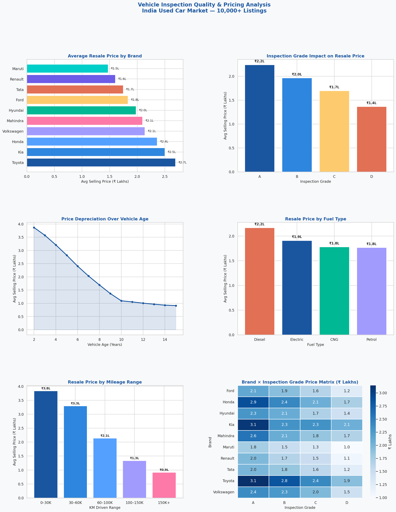

# 🚗 Vehicle Inspection Quality & Pricing Analysis


> **Analyzing how inspection grades, mileage, fuel type, and OEM brand impact used car resale pricing across the Indian market — inspired by real-world work at Spinny.**

---

## 📌 Project Overview

This project analyzes **10,000+ used vehicle listings** from the Indian market to uncover what factors drive resale pricing. The analysis focuses on:

- How **inspection grades (A–D)** affect resale value
- Which **OEM brands** (Maruti, Honda, Toyota, etc.) retain value best
- The **price premium** for diesel, automatic transmission, and low-mileage cars
- How **vehicle age and km driven** impact depreciation curves

---

## 📊 Dashboard Preview



---

## 🔍 Key Business Insights

| Insight | Finding |
|---|---|
| 🏆 Inspection Grade Impact | Grade A cars command **64% premium** over Grade D |
| ⛽ Diesel Premium | Diesel vehicles priced **~23% higher** than petrol |
| ⚙️ Transmission Premium | Automatic transmission adds **~30% to resale value** |
| 🏭 Top Brand by Value | Toyota holds the **highest avg resale price** (₹2.69L) |
| 📍 Low Mileage Advantage | Cars under 30K km valued **4x higher** than 150K+ km cars |
| 👤 First Owner Advantage | 1st owner cars priced **~14% higher** than 2nd owner |

---

## 🗂️ Project Structure

```
vehicle-inspection-analysis/
│
├── data/
│   ├── generate_data.py        # Dataset generation script
│   └── car_inspection_data.csv # 10,000 row dataset
│
├── analysis.py                 # Main Python analysis + visualizations
│
├── sql/
│   └── analysis_queries.sql    # 10 SQL queries for business insights
│
├── images/
│   └── analysis_dashboard.png  # Output dashboard (6 charts)
│
└── README.md
```

---

## 🛠️ Tools & Technologies

| Tool | Usage |
|---|---|
| **Python** | Data cleaning, EDA, visualizations |
| **Pandas** | Data manipulation and aggregation |
| **Matplotlib / Seaborn** | Chart generation |
| **SQL** | Business queries (brand, grade, KM, fuel analysis) |
| **Excel / Power BI** | Dashboard (see dashboard folder) |

---

## ▶️ How to Run

**1. Clone the repo**
```bash
git clone https://github.com/yourusername/vehicle-inspection-analysis.git
cd vehicle-inspection-analysis
```

**2. Install dependencies**
```bash
pip install pandas numpy matplotlib seaborn
```

**3. Generate dataset**
```bash
python data/generate_data.py
```

**4. Run analysis**
```bash
python analysis.py
```

Charts will be saved to `images/analysis_dashboard.png`

---

## 📈 Analysis Breakdown

### 1. Brand Resale Value
Toyota and Kia lead resale pricing while Maruti dominates listing volume (~30%). Honda ranks 3rd in avg resale price despite mid-range volume.

### 2. Inspection Grade Impact
Inspection grade is the **single biggest controllable factor** in resale pricing:
- **Grade A** → ₹2.24L avg
- **Grade D** → ₹1.37L avg
- A → D represents a **64% price drop**

### 3. Depreciation Curve
Vehicles depreciate steeply in the first 5 years, then flatten. The steepest drop occurs between **year 1–3**, making early resale timing critical.

### 4. Mileage Buckets
| KM Range | Avg Price |
|---|---|
| 0 – 30K | ₹3.84L |
| 30 – 60K | ₹3.30L |
| 60 – 100K | ₹2.14L |
| 100 – 150K | ₹1.34L |
| 150K+ | ₹0.92L |

---

## 💡 Business Recommendations

1. **Prioritize Grade A acquisitions** — they command 64% premium, making inspection quality the highest ROI factor in sourcing strategy.
2. **Target diesel automatics under 60K km** — this segment consistently achieves top-quartile resale prices.
3. **Flag Grade D vehicles for reconditioning** before listing — upgrading grade from D→B can recover ₹60K+ in value.
4. **Focus sourcing on Toyota and Honda** for maximum margin potential per unit.

---

## 👤 Author

**Mohd Aaseen**  
B.Tech Automotive Engineering — Delhi Technological University  
Data Analyst Intern @ Spinny  
📧 mohdaaseen_ch22b3_45@dtu.ac.in  
🔗 [LinkedIn](https://linkedin.com/in/yourprofile)

---

## ⭐ If you found this useful, drop a star!
